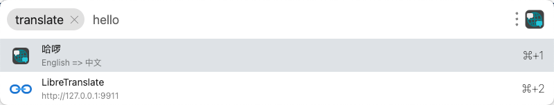

# 功能
- 无需网络，基于LibreTranslate的本地翻译
- 通过检测剪贴板，进行翻译。或者直接输入翻译
- 选中后复制译文

# 依赖项
**可用的LibreTranslate API**
两种方法安装：
- 基于国内的二次打包版本，一键式部署：[jianchang512/ott: Api tool for local offline text translation supporting multiple languages/支持多语言的本地离线文字翻译api](https://github.com/jianchang512/ott)
- 按照官网指导进行部署：[LibreTranslate/LibreTranslate: Free and Open Source Machine Translation API. Self-hosted, offline capable and easy to setup.](https://github.com/LibreTranslate/LibreTranslate)

